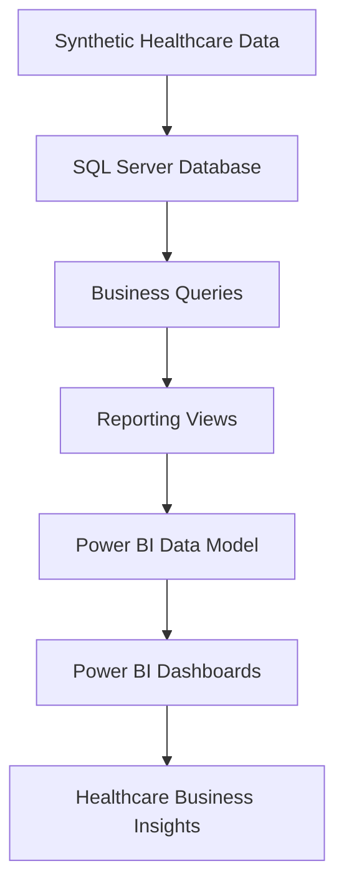
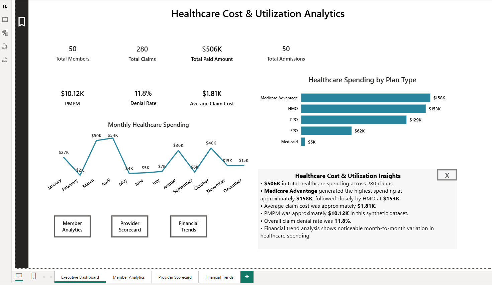
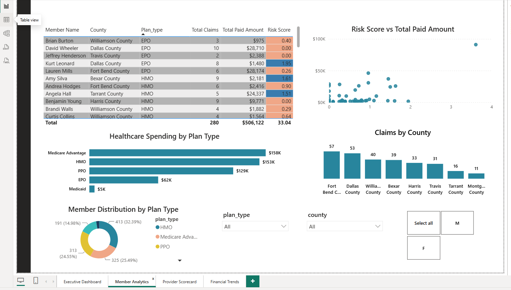
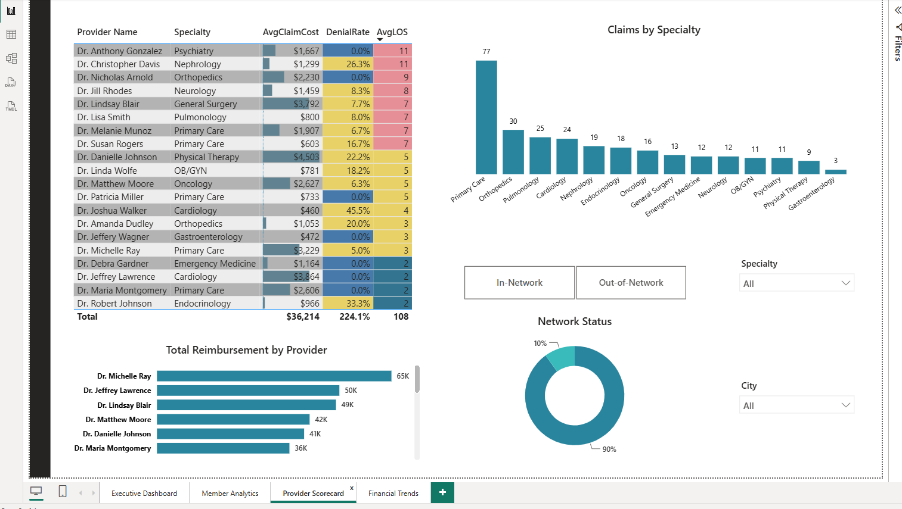
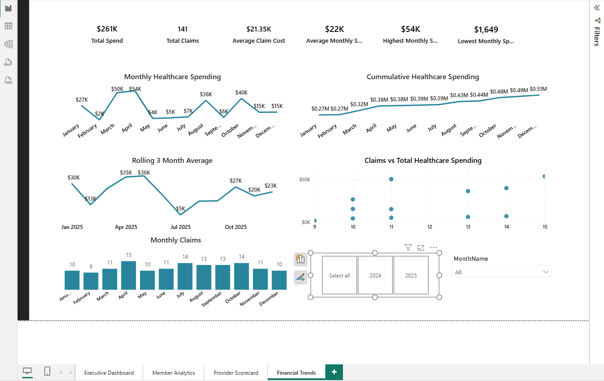

# Healthcare Cost & Utilization Analytics

## Project Overview

This project analyzes synthetic healthcare claims, member utilization, provider performance, and financial trends using SQL Server Management Studio (SSMS) and Power BI.

The project simulates a healthcare payer analytics environment where claims, member, provider, admission, diagnosis, and procedure data are analyzed to identify cost drivers, utilization patterns, provider performance, and financial trends.

The goal of the project is to demonstrate an end-to-end healthcare analytics workflow from database creation and SQL analysis to reporting views and interactive Power BI dashboards.

> **Note:** This project uses entirely synthetic data and contains no PHI or PII.

---

## Tools & Technologies

- SQL Server Management Studio (SSMS)
- SQL Views
- Power BI
- Data Modeling
- GitHub

---

## Project Architecture

---

## Data Model

The project uses six healthcare-related tables:

| Table | Purpose |
|---|---|
| Members | Member demographics, enrollment, plan type, county, and PCP |
| Providers | Provider demographics, specialty, facility, location, and network status |
| Claims | Claim-level utilization, diagnosis/procedure codes, billed and paid amounts, and claim status |
| Admissions | Inpatient admissions, length of stay, DRG information, admission type, and paid amount |
| HCC_Mapping | Diagnosis-to-HCC mapping and risk weights |
| Procedure_Lookup | Procedure descriptions and categories |

---

## Power BI Dashboard

The Power BI report contains four analytical pages.

### 1. Executive Dashboard

Provides a high-level overview of healthcare cost and utilization, including key KPIs, healthcare spending by plan type, monthly spending trends, business insights, and navigation to detailed report pages.

### 2. Member Analytics

Analyzes member-level utilization, healthcare spending, risk scores, plan distribution, and geographic claim patterns.

### 3. Provider Scorecard

Evaluates provider performance using reimbursement, claim volume, denial rate, average claim cost, average length of stay, specialty, and network status.

### 4. Financial Trends

Analyzes monthly healthcare spending, cumulative spending, rolling averages, claim volume, and the relationship between claims and healthcare costs.

---

## SQL Workflow

The SQL portion of the project is organized into three stages:

### 01 — Table Creation

Creates and populates the healthcare analytics database tables used throughout the project.

Core datasets include:

- Members
- Claims
- Providers
- Admissions
- HCC Mapping
- Procedure Lookup

### 02 — Business Queries

Contains SQL analysis used to answer healthcare business questions and demonstrate:

- Filtering and aggregation
- GROUP BY and HAVING
- JOIN operations
- CASE expressions
- Common Table Expressions (CTEs)
- Subqueries
- Window functions
- Ranking
- Running totals
- Rolling averages
- Healthcare cost and utilization metrics

### 03 — Reporting Views

Creates reusable SQL reporting views that serve as reporting layers for Power BI.

The primary views are:

- `vw_Executive_Metrics`
- `vw_MemberAnalytics`
- `vw_ProviderScorecard`
- `vw_MonthlyFinancialTrends`

---

## Power BI Skills Demonstrated

- KPI cards
- Bar and column charts
- Line charts
- Scatter plots
- Donut charts
- Slicers
- Conditional formatting
- Bookmarks and selection pane
- Page navigation
- SQL Server connectivity
- Reporting views as the semantic/reporting layer

---

## Key Insights

- Total healthcare paid amount was approximately **$506K** across **280 claims**.
- **Medicare Advantage** generated the highest plan-level healthcare spending at approximately **$158K**, followed closely by **HMO** at approximately **$153K**.
- Average claim cost was approximately **$1.81K**.
- Overall claim denial rate was approximately **11.8%**.
- Member analysis identified high-cost and higher-risk members for deeper utilization review.
- Primary Care generated the highest claim volume among provider specialties.
- Provider denial rates and average length of stay varied across the provider network.
- Monthly healthcare spending showed substantial month-to-month variation, supported by cumulative and rolling-average trend analysis.

